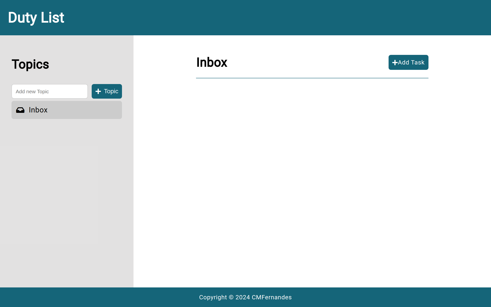
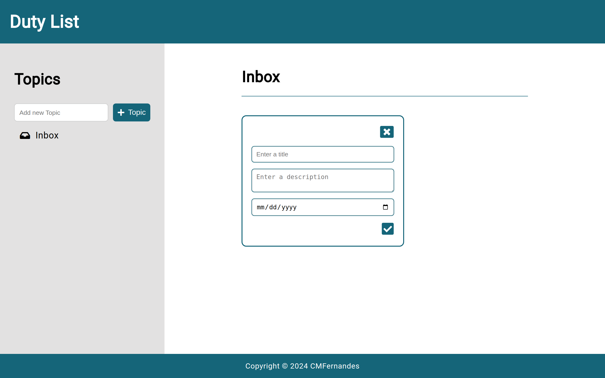
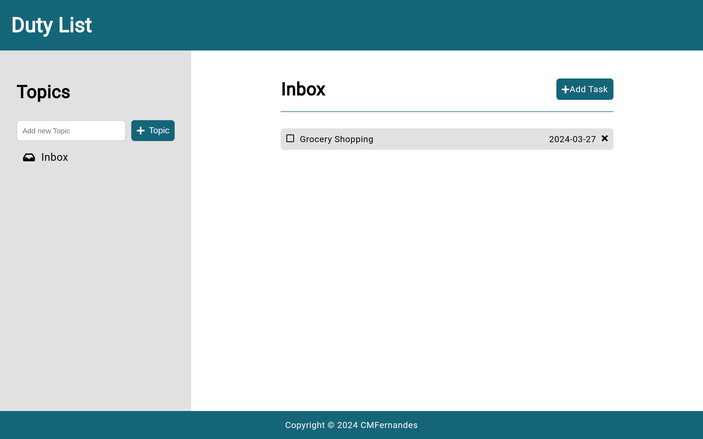

# Todo-list

:point_right: [live demo](https://cmfernandes.github.io/todo-list/) 

---

## About

Assigment from [The Odin Project](https://www.theodinproject.com/lessons/node-path-javascript-todo-list) Javascript course. 